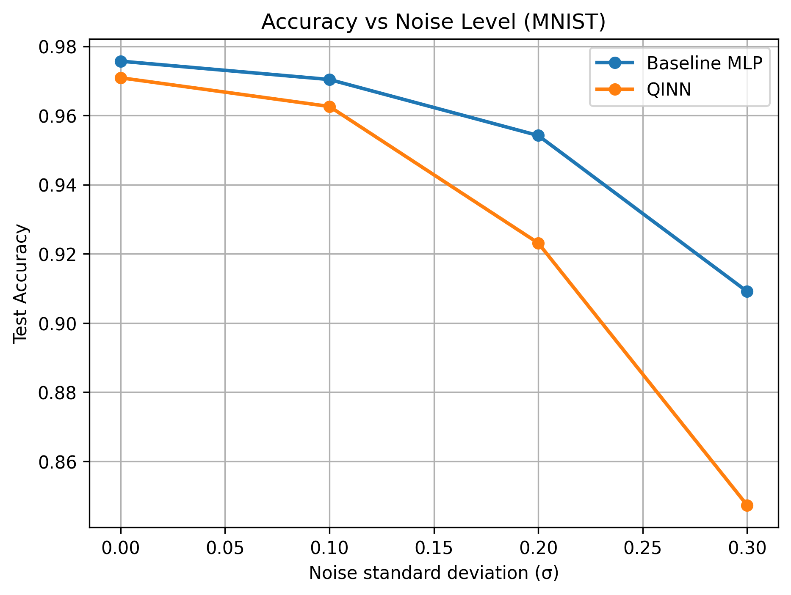

# Quantum-Inspired Neural Networks (QINN)

**Author:** Ghanta Krishna Murthy  
**Domain:** Artificial Intelligence / Machine Learning  
**Focus:** Quantum-Inspired Learning on Classical Hardware  

---

## Motivation
Quantum Machine Learning (QML) promises computational advantages but remains
constrained by scarce, noisy, and expensive quantum hardware.  
This project investigates whether **quantum-inspired inductive biases** can be
embedded into **classical neural networks**, improving learning behavior **without
using quantum devices**.

---

## Core Idea
We abstract three key principles from quantum mechanics:

- **Superposition** — learning multiple representations simultaneously  
- **Phase** — introducing degrees of freedom beyond magnitude  
- **Interference** — constructive and destructive feature interactions  

These principles are implemented using **real-valued, differentiable operations**
fully compatible with PyTorch and GPU acceleration.

---

## Architecture: Quantum-Inspired Layer (QIL)
The proposed **Quantum-Inspired Layer (QIL)** decomposes features into two branches:

- **Amplitude branch** — captures feature strength  
- **Phase branch** — controls interference dynamics  

The layer output is computed as:
```
output = amplitude × cos(phase)
```

This formulation introduces **phase-sensitive interference** while remaining
hardware-agnostic and computationally efficient.

---

## Experiments

### 1. Baseline vs QINN (MNIST)
- QINN converges faster than a classical MLP
- Achieves comparable final accuracy

### 2. Low-Data Regime (10% Training Data)
- QINN outperforms the baseline by **2–3% test accuracy**
- Indicates improved **sample efficiency**

### 3. Robustness to Noise
- Accuracy degrades as input noise increases
- Reveals a **robustness–expressivity trade-off**



---

## Getting Started

### Installation
```bash
pip install torch torchvision numpy matplotlib
```

---

## Quick Demo
```
import torch
from qinn.models.qil import QuantumInspiredLayer

x = torch.randn(4, 128)
qil = QuantumInspiredLayer(128, 256)
y = qil(x)

print(y.shape)
```

---

## End-to-End Training
Run the complete MNIST experiment:
```bash
python run_mnist_experiment.py
```

---

## Related Work (Research-Focused)
**Schuld et al. (2015)** and **Biamonte et al. (2017)** explore quantum machine learning
using variational quantum circuits. **Tang (2019)** demonstrates quantum-inspired
classical algorithms. This work builds on these ideas by embedding
phase-based interference directly into neural architectures without
simulating quantum circuits.

---

## Limitations and Future Work
While QINN improves sample efficiency, it is more sensitive to strong input noise.
Future work includes:

- **Phase regularization**
- **Adaptive interference control**
- **Evaluation on higher-dimensional datasets**

---

## Reproducibility
All experiments are fully reproducible using Kaggle notebooks or any standard GPU
environment with PyTorch.
